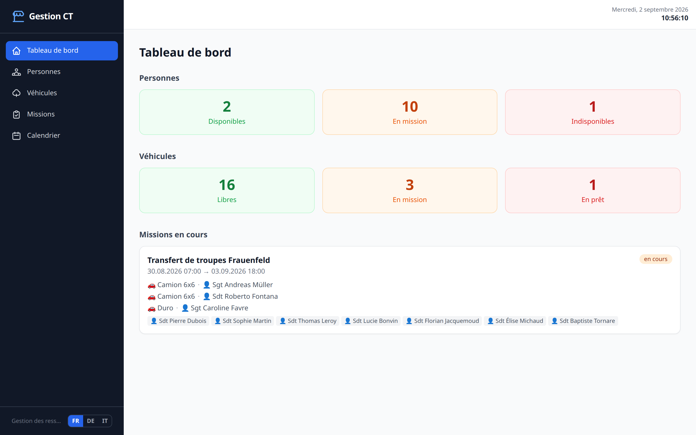
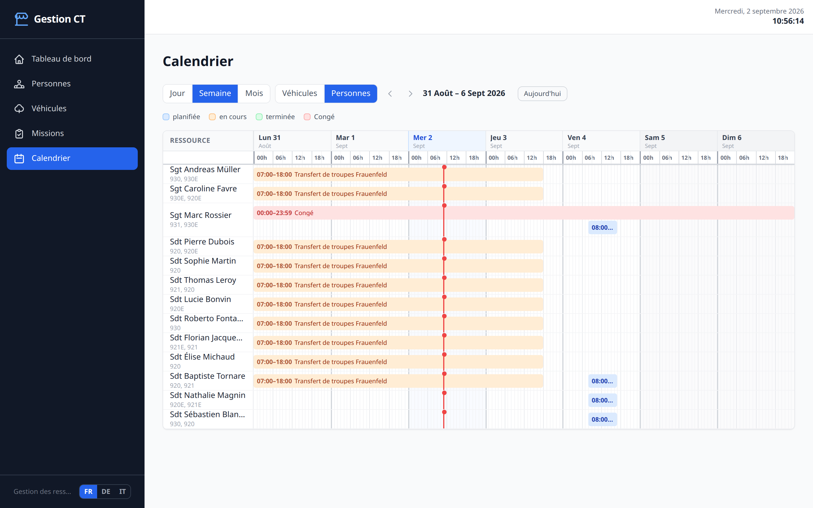
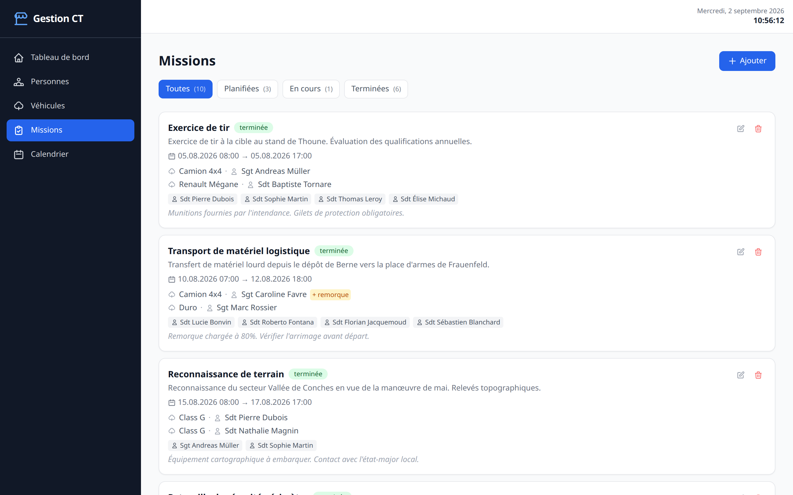
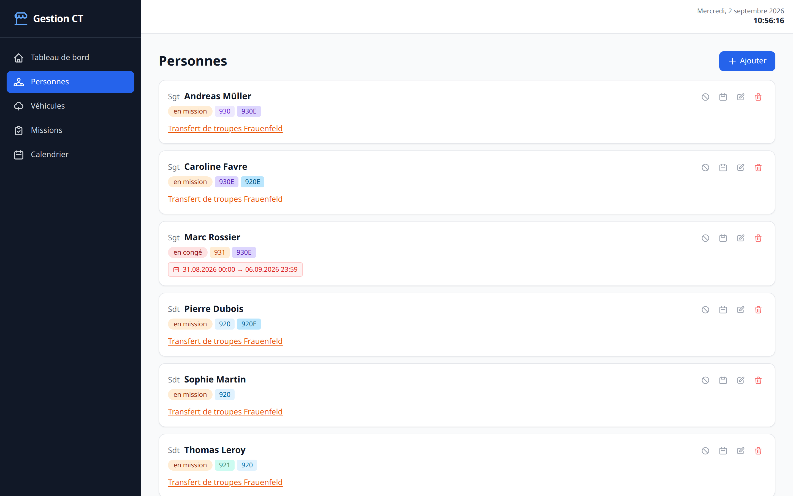
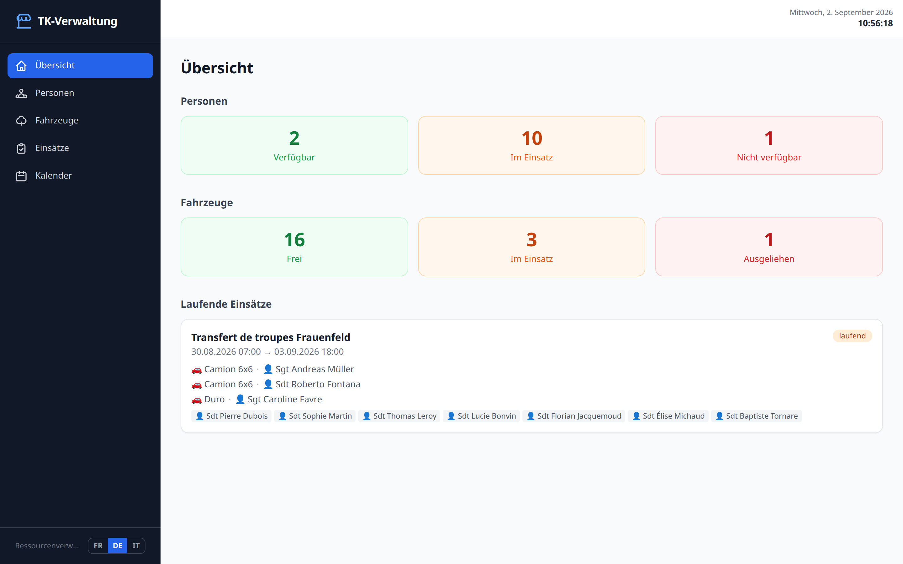

# Gestion CT — Application de gestion des ressources

Application web de gestion des ressources d'une compagnie de transport (CT) :
personnels, véhicules et missions, avec calendrier intégré. Les statuts
(disponible, en mission, en congé, en prêt) se déduisent des dates saisies,
et les conflits d'affectation sont détectés à la saisie.

Interface disponible en **français, allemand et italien**.

Vue 3 · Pinia · Tailwind · Express · stockage en fichiers JSON, sans base de
données à installer.

Auteur : Kévin Jordil

## Aperçu

**Tableau de bord** — disponibilités en un coup d'œil, missions en cours et
alertes automatiques (chauffeur en congé, véhicule prêté pendant une mission).



**Calendrier** — vues jour, semaine et mois, sur les véhicules ou le
personnel. Les chevauchements sont empilés sur plusieurs pistes et la ligne
rouge marque l'heure actuelle.



**Missions** — filtrage par statut, affectation de plusieurs véhicules avec
ou sans chauffeur, et contrôle des permis requis par catégorie de véhicule.



**Personnes** — permis militaires suisses, congés et indisponibilités.



**Multilingue** — toute l'interface bascule en allemand ou en italien depuis
le sélecteur en bas de la barre latérale, y compris les noms de jours et de
mois du calendrier.



> Les captures utilisent le jeu de démonstration livré avec le projet, dont
> les dates sont recalées sur le jour de l'installation.

## Fonctionnalités

### Personnes
- Fiche par personne avec **grade**, prénom, nom, **téléphone**, permis de conduire et notes
- **Congés** : ajout de périodes de congé avec date/heure précises
- **Indisponibilité** : marquage d'une personne indisponible avec commentaire (garde, affectation temporaire, etc.)
- Statut calculé automatiquement : *disponible*, *en congé*, *indisponible*

### Véhicules
- Fiche par véhicule avec nom, immatriculation, catégorie (léger / moyen / lourd)
- Statut dynamique : *libre*, *en mission* (calculé depuis les missions actives), *en prêt* (manuel, avec commentaire et date de retour prévue signalée en cas de dépassement)
- Mise en prêt et libération depuis la fiche véhicule

### Clés
Le tableau des clés répond à la question posée au guichet : *puis-je prendre ce
véhicule ?* Il se lit indépendamment du planning.

- Chaque véhicule affiche sa clé : **au tableau** (le véhicule est disponible)
  ou **chez quelqu'un**, avec le nom et l'heure de la prise
- N'importe quelle personne connectée peut enregistrer une prise, un transfert
  ou un retour, pour n'importe quel véhicule : la clé dit où elle est, elle
  n'autorise pas à conduire — le permis reste affaire de la fiche personne
- Une clé peut être prêtée à quelqu'un **hors système** (garage, autre unité),
  enregistré au seul nom ; le retour peut être saisi par n'importe qui
- Chaque mouvement est horodaté et garde le compte qui l'a saisi ; les
  cinquante derniers sont consultables depuis la fiche véhicule
- Supprimer une personne qui détient une clé ne remet pas la clé au tableau :
  elle reste sortie, sous le nom enregistré

### Missions
- Titre, description, dates de début et fin avec précision à l'heure
- Affectation de **plusieurs véhicules** par mission, chacun avec ou sans chauffeur
- Affectation de **personnel sans véhicule** (personnel libre)
- Statut **automatique** calculé depuis les dates : *planifiée*, *en cours*, *terminée* — aucune saisie manuelle
- Filtrage par statut, compteurs en temps réel
- Les personnes en congé, indisponibles ou déjà affectées sont exclues des listes de sélection
- Les véhicules en prêt ou déjà engagés sur la même période sont exclus

### Demandes de véhicules
- **Page publique** `/#/request`, accessible sans compte : formulaire de contact, dates, point de rendez-vous et liste des véhicules souhaités, chacun avec ou sans chauffeur
- **File de traitement** côté gestion : filtrage par statut, détail dépliable, compteur des demandes en attente dans la barre latérale
- **Décision attribuée** : le compte qui approuve ou refuse est enregistré avec la date et l'heure, et un refus peut porter un motif
- **Recherche** sur les listes personnes, véhicules, missions et demandes — accents et casse ignorés, plusieurs mots combinables
- **Approuver crée la mission** : le formulaire de mission s'ouvre pré-rempli depuis la demande (titre, contact, dates, point de rendez-vous et véhicules en notes) ; la demande ne passe à *approuvée* qu'une fois la mission enregistrée

### Impression et PDF
Quatre documents, mis en page pour l'A4 et produits par l'impression du
navigateur — aucune bibliothèque PDF n'est embarquée :

| Document | Depuis |
|----------|--------|
| **Ordre de mission** | l'icône imprimante d'une fiche mission |
| **Liste des missions** | bouton de la page Missions, filtre de statut inclus |
| **Calendrier de la période** | bouton de la page Calendrier — rendu en tableau, la timeline en pixels étant illisible sur papier |
| **État des SPH** | bouton de la page SPH |

### Configuration
- **Types de véhicules** proposés sur le formulaire public : réordonnables, supprimables, et extensibles par des types propres à l'unité
- **Permis** et **matrice permis/catégorie** (avec et sans remorque) modifiables ; ce sont ces règles qui déterminent quels chauffeurs sont proposés pour un véhicule
- Les catégories de véhicules ne sont pas modifiables : elles suivent la réglementation et toute la logique de disponibilité repose sur elles

> Les types fournis avec l'application sont traduits dans les trois langues.
> Un type ajouté par l'utilisateur garde l'étiquette saisie, telle quelle,
> quelle que soit la langue affichée.

### SPH — service de parc hebdomadaire
- Historique des contrôles par véhicule, chacun daté et attribué soit à une personne, soit à un commentaire libre (atelier, contrôle externe…)
- Statut calculé depuis la date du dernier contrôle : *à jour* en deçà de sept jours, *à refaire* le septième, *en retard* au-delà, *jamais effectué* si aucun n'existe
- Liste triée par urgence — jamais contrôlés d'abord, puis du plus ancien au plus récent

### Vue de parc
- Plan du parc **téléversé depuis le navigateur** (JPEG, PNG ou WebP), redimensionné et recompressé côté client avant l'envoi
- **Zones dessinées sur le plan** au cliquer-glisser, déplaçables, redimensionnables par les coins et inclinables à la poignée
- Chaque zone porte une couleur ; l'**étiquette est attachée à la couleur**, ce qui donne une légende automatique (Camions, Véhicules légers…)
- Les zones sont enregistrées en **fractions de l'image**, donc indépendantes de sa résolution et de la taille d'affichage

### Tableau de bord
- Bandeau **À traiter** en tête de page : demandes en attente, SPH à faire, prêts en retard — chaque tuile mène à la page concernée, et disparaît quand il n'y a rien
- Vue synthétique : disponibilités personnes et véhicules, missions en cours
- **Clés des véhicules** : d'un côté les véhicules dont la clé est au tableau,
  de l'autre les clés sorties avec leur détenteur et l'heure de la prise
- Alertes automatiques (chauffeur en congé pendant une mission, véhicule en prêt sur une mission active, etc.)

### Calendrier
Trois modes de visualisation, deux onglets de ressources (Véhicules / Personnes) :

| Mode | Description |
|------|-------------|
| **Jour** | Timeline sur 24 h, précision à l'heure |
| **Semaine** | Timeline du lundi au dimanche |
| **Mois** | Diagramme de Gantt mensuel |

- Indicateur de l'heure actuelle (ligne rouge) en vue jour/semaine
- Superposition des événements gérée par empilement de pistes (*lane packing*)
- Congés visibles dans l'onglet Personnes
- Navigation prev/next et bouton *Aujourd'hui*

---

## Langues

L'interface est traduite en **français**, **allemand** et **italien**. La
langue se choisit depuis la barre latérale ; le choix est conservé dans le
navigateur. Au premier accès, la langue est déduite des préférences du
navigateur, avec le français par défaut.

Les noms de jours et de mois du calendrier viennent d'`Intl`, ils suivent donc
la langue active sans table de correspondance à maintenir.

### Ajouter une langue

1. Copier `src/locales/fr.json` vers `src/locales/<code>.json` et traduire les
   valeurs (les clés ne changent pas).
2. Déclarer la langue dans `src/i18n/index.js` : l'ajouter à
   `SUPPORTED_LOCALES` (code, libellé, balise `Intl`) et au dictionnaire
   `messages`.

Les tests vérifient que les trois catalogues ont exactement les mêmes clés ;
une clé oubliée est donc détectée avant la mise en production.

---

## Stack technique

| Couche | Technologie |
|--------|-------------|
| Frontend | Vue 3 (Composition API) + Vite |
| État | Pinia 3 |
| Routage | Vue Router 4 |
| Style | Tailwind CSS 3 |
| Backend | Express 4 (Node.js) |
| Stockage | Fichiers JSON (`data/`) avec mutex async et écriture atomique |
| Traductions | vue-i18n 11 (fr / de / it) |
| Tests | Vitest + Vue Test Utils |

---

## Prérequis

- **Node.js** 18 ou supérieur
- **npm** 9 ou supérieur

---

## Installation

```bash
# Cloner ou copier le projet, puis :
npm install
```

---

## Lancement en développement

```bash
npm run dev
```

Cette commande démarre en parallèle :
- le serveur Express sur **http://localhost:3000** (API + stockage)
- le serveur de développement Vite sur **http://localhost:5173** (hot reload)

Ouvrir **http://localhost:5173** dans le navigateur.

> Les données sont stockées dans le dossier `data/` à la racine du projet
> (créé automatiquement, non versionné). Au premier lancement, chaque
> collection absente est initialisée depuis `data.example/`, avec les dates
> recalées sur le jour de l'installation : le tableau de bord et le calendrier
> montrent donc immédiatement une activité réaliste.

---

## Tests

```bash
npm test          # une passe
npm run test:watch
```

Les tests s'exécutent aussi automatiquement à chaque push et sur chaque pull
request (`.github/workflows/ci.yml`), dans le fuseau `Europe/Zurich` — les
helpers de date et le calendrier en dépendent.

La suite couvre les helpers de date et la logique de disponibilité, la
migration des anciens formats, la validation côté serveur, le recalage du jeu
de démonstration, le store de collection (versions, conflits, garde
anti-écrasement), la navigation du calendrier, les vues dans les trois
langues, et le serveur de bout en bout (authentification, validation,
concurrence).

---

## Build de production

```bash
npm run build
```

Le frontend est compilé dans `dist/`. Le serveur Express sert ensuite les fichiers statiques.

### Lancement en production

```bash
npm run build   # indispensable : le serveur sert dist/
npm run server
```

> `dist/` n'est pas versionné. Après un `git pull`, **reconstruisez** avant de
> relancer, sinon le serveur sert l'ancienne interface.

Ouvrir **http://localhost:3000**.

### Impression et PDF
Quatre documents, mis en page pour l'A4 et produits par l'impression du
navigateur — aucune bibliothèque PDF n'est embarquée :

| Document | Depuis |
|----------|--------|
| **Ordre de mission** | l'icône imprimante d'une fiche mission |
| **Liste des missions** | bouton de la page Missions, filtre de statut inclus |
| **Calendrier de la période** | bouton de la page Calendrier — rendu en tableau, la timeline en pixels étant illisible sur papier |
| **État des SPH** | bouton de la page SPH |

### Configuration

| Variable | Défaut | Rôle |
|----------|--------|------|
| `PORT` | `3000` | Port d'écoute |
| `DATA_DIR` | `./data` | Dossier des fichiers JSON |
| `SEED_DIR` | `./data.example` | Données de démonstration du premier lancement |
| `CT_PASSWORD` | *(généré)* | Mot de passe du premier administrateur — voir ci-dessous |
| `CORS_ORIGIN` | *(vide)* | Origine autorisée si le frontend est servi ailleurs |
| `TRUST_PROXY` | *(vide)* | À définir derrière un reverse proxy — voir ci-dessous |

```bash
PORT=8080 CT_PASSWORD=un-mot-de-passe-solide node server.js
```

### Sécurité

L'application est protégée par des **comptes nominatifs**. À la première
visite, l'utilisateur arrive sur `/login` ; toutes les autres pages et toutes
les routes de l'API lui sont fermées tant qu'il n'est pas connecté.

Deux rôles :

| Rôle | Peut faire |
|------|-----------|
| **Administrateur** | Tout, y compris la gestion des comptes et la configuration |
| **Utilisateur** | Personnes, véhicules, missions, demandes, parc et SPH. Ni comptes ni configuration |

**Un militaire se connecte avec son nom de famille.** Le mot de passe se
définit sur sa fiche, à la création ou plus tard : tant qu'il n'est pas
défini, la personne existe dans l'application mais ne peut pas se connecter.
Supprimer la fiche supprime le compte. Deux personnes ne peuvent pas partager
un nom de famille pour la connexion — le formulaire le signale au lieu
d'écraser un compte.

Le compte créé depuis une fiche a le rôle *utilisateur* ; seul un
administrateur peut le promouvoir, depuis la page Comptes.

**Aucune contrainte sur les mots de passe** : ni longueur minimale, ni
composition imposée. L'application tourne sur un réseau fermé, et une règle
que l'on contourne en ajoutant un chiffre à la fin n'apporte rien. La seule
exigence est qu'il y en ait un — un compte sans mot de passe est précisément
la manière dont s'exprime « ne peut pas encore se connecter ».

Les mots de passe sont stockés hachés
(scrypt, sel propre à chaque compte) ; ils ne ressortent jamais du serveur.
Réinitialiser un mot de passe ou changer un rôle **met fin à toutes les
sessions** du compte concerné.

Le plan du parc ne fait pas exception : il est servi derrière la session et
récupéré en JavaScript, une balise `` ne pouvant pas porter d'en-tête
d'authentification. Le format SVG est refusé à l'envoi, car il peut contenir
du script.

Deux pages échappent à cette règle, par nécessité : l'écran de connexion et
le formulaire public de demande de véhicule. Ce dernier est la seule écriture
ouverte sans session, il est donc le plus strictement encadré — validation
complète de chaque champ, types de véhicules limités à une liste connue,
maximum 5 envois par période de 10 minutes et par adresse, et plafond global
sur le nombre de demandes conservées.

```bash
CT_PASSWORD="$(openssl rand -base64 18)" node server.js
```

#### Mot de passe administrateur perdu

```bash
npm run reset-admin                  # compte « admin », mot de passe généré
npm run reset-admin -- cfavre        # un autre compte, mot de passe généré
npm run reset-admin -- cfavre secret # mot de passe choisi
```

La commande réinitialise le mot de passe du compte visé — ou le recrée s'il a
disparu — **sans toucher aux autres comptes**, et lui rend le rôle
administrateur. Elle s'exécute sur le serveur : y accéder suppose déjà un
accès shell à la machine.

#### Premier démarrage

Au tout premier démarrage, un administrateur nommé **`admin`** est créé.
Son mot de passe vient de `CT_PASSWORD` ; sans cette variable, le serveur en
**génère un aléatoire** et l'affiche une fois dans la console. Il n'existe
aucun mot de passe par défaut, et la variable n'est plus consultée une fois
le compte créé.

Le navigateur ne conserve jamais le mot de passe. La connexion l'échange
contre un **jeton de session** aléatoire, sans lien avec lui, valable
30 jours et révocable côté serveur : se déconnecter invalide immédiatement
ce jeton sans affecter les autres sessions.

La connexion est **limitée à 10 tentatives par quart d'heure et par adresse**.
Une tentative réussie remet le compteur à zéro, de sorte qu'un utilisateur
légitime qui se trompe une fois n'est jamais pénalisé.

> **Derrière un reverse proxy**, définissez `TRUST_PROXY`, sans quoi toutes
> les requêtes semblent venir de l'adresse du proxy : les utilisateurs se
> bloqueraient mutuellement, et la limite deviendrait contournable.
>
> - un seul proxy local (nginx, Caddy, Traefik) : `TRUST_PROXY=1`
> - **derrière Cloudflare** : `TRUST_PROXY=2` si Cloudflare est lui-même
>   devant votre proxy, car deux intermédiaires ajoutent chacun leur adresse
>   à `X-Forwarded-For`. Vérifiez la valeur retenue en consultant l'adresse
>   effectivement vue par le serveur avant de vous y fier.

En développement, Vite proxifie `/api` vers le serveur Express : les requêtes
sont de même origine et aucun en-tête CORS n'est nécessaire. `CORS_ORIGIN`
n'est utile que si le frontend est servi depuis une autre origine.

### Derrière Cloudflare

Chaque build produit des noms de fichiers différents (`index-BMAR6jcd.js`).
Si `index.html` est servi depuis le cache alors que les fichiers ont changé,
le navigateur réclame des ressources qui n'existent plus et l'application ne
démarre pas. Deux précautions :

- **purger le cache** après chaque déploiement ;
- ne pas mettre `index.html` en cache longue durée — seuls les fichiers de
  `assets/`, dont le nom contient une empreinte, peuvent l'être.

Désactivez également **Rocket Loader** : il réécrit le chargement des scripts
et se marie mal avec les modules ES d'une application Vue.

### Modifications concurrentes

Chaque lecture renvoie une version (`ETag`) et chaque écriture doit la
présenter (`If-Match`). Si deux onglets modifient la même collection, le
second reçoit un `409` et l'interface propose de recharger, au lieu d'écraser
silencieusement le travail du premier.

---

## Structure du projet

```
ct_manager/
├── data/                  # Données de travail (créé au 1er lancement, non versionné)
├── data.example/          # Données de démonstration servant d'amorçage
├── docs/                  # Captures d'écran du README
├── src/
│   ├── api.js             # Client HTTP (clé d'accès, versions, erreurs typées)
│   ├── constants.js       # Vocabulaire métier : statuts, catégories, permis
│   ├── datetime.js        # Dates en heure locale (jamais toISOString)
│   ├── availability.js    # Règles métier : statuts et disponibilité
│   ├── checks.js          # Échéances des contrôles hebdomadaires
│   ├── config.js          # Réglages modifiables et valeurs par défaut
│   ├── migrations.js      # Lecture des formats de données antérieurs
│   ├── labels.js          # Helpers d'affichage partagés
│   ├── id.js              # Génération d'identifiants
│   ├── i18n/              # Configuration vue-i18n et formats de dates
│   ├── locales/           # fr.json, de.json, it.json
│   ├── stores/            # Stores Pinia
│   │   ├── collection.js  # Squelette commun aux trois collections
│   │   ├── clock.js       # Horloge réactive partagée
│   │   ├── sync.js        # État de synchronisation (erreurs, conflits)
│   │   ├── persons.js
│   │   ├── vehicles.js
│   │   └── missions.js
│   ├── components/
│   │   ├── common/        # BaseModal, ConfirmModal, StatusBadge, ListPlaceholder, AccessKeyModal, LanguageSwitcher
│   │   ├── persons/       # PersonCard, PersonForm, LeavesModal, PersonUnavailableModal
│   │   ├── vehicles/      # VehicleCard, VehicleForm, LoanModal
│   │   ├── missions/      # MissionCard, MissionForm
│   │   └── calendar/      # CalendarGrid (mois), CalendarTimeline (jour/semaine)
│   ├── views/
│   │   ├── DashboardView.vue
│   │   ├── PersonsView.vue
│   │   ├── VehiclesView.vue
│   │   ├── MissionsView.vue
│   │   ├── CalendarView.vue
│   │   ├── LoginView.vue      # publique
│   │   ├── RequestView.vue    # publique : formulaire de demande
│   │   ├── RequestsView.vue   # file de traitement
│   │   ├── ParkView.vue       # plan du parc et zones
│   │   ├── ChecksView.vue     # SPH
│   │   └── ConfigView.vue     # configuration
│   └── __tests__/         # Tests unitaires et de composants
├── test/                  # Tests d'intégration du serveur
├── server.js              # Serveur Express
├── auth.js                # Connexion par mot de passe et sessions
├── validation.js          # Validation des collections reçues par l'API
├── seed.js                # Recalage des dates du jeu de démonstration
├── vite.config.js
├── vitest.config.js
├── tailwind.config.js
└── package.json
```

### Conventions

- **Le code est en anglais** — noms, commentaires, schéma de données, valeurs
  de statut. Le français, l'allemand et l'italien n'existent que dans
  `src/locales/` et dans ce README. Aucun texte affiché n'est écrit en dur
  dans un composant : tout passe par une clé de traduction.
- **Les dates sont des chaînes locales** (`YYYY-MM-DDTHH:mm`), comparables
  directement. `toISOString()` est proscrit pour les produire : il convertit
  en UTC et décale le résultat d'une à deux heures — donc parfois d'un jour.
  Tout passe par `src/datetime.js`.
- **L'instant courant vient de `useClock()`**, jamais de `new Date()` dans un
  `computed` : Vue ne trace pas le temps comme dépendance, et les statuts
  cesseraient de se rafraîchir.
- **Les statuts ne sont pas stockés** : mission (`planned` / `ongoing` /
  `completed`) et véhicule (`free` / `on-mission`) se déduisent des dates.
- **Les erreurs de l'API sont des codes**, pas des phrases : le serveur
  renvoie `{code, params}` et l'interface les rend dans la langue du lecteur.

### Modèle de données

Les fichiers JSON utilisent des clés anglaises :

| Collection | Champs |
|------------|--------|
| `persons` | `id`, `rank`, `firstName`, `lastName`, `licenses[]`, `notes`, `leaves[{id, startDate, endDate}]`, `unavailable`, `unavailabilityNote` |
| `vehicles` | `id`, `name`, `plate`, `category`, `status`, `loanNote`, `loanUntil`, `seats`, `checks[]`, `keyHolder`, `keyHistory[]` |
| `missions` | `id`, `title`, `description`, `startDate`, `endDate`, `notes`, `vehicles[{id, vehicleId, driverId, withTrailer}]`, `staffIds[]` |

`keyHolder` vaut `null` quand la clé est au tableau, sinon
`{personId, name, since, recordedBy}` — `personId` est `null` pour un
détenteur hors système, et le nom enregistré sert alors d'identité.

Les fichiers écrits par une version antérieure — schéma français, statut de
véhicule stocké, mission à véhicule unique, permis civils — sont convertis au
chargement par `src/migrations.js`. La conversion est couverte par des tests
et ne demande aucune intervention manuelle.

---

## Sauvegarde des données

Les données sont persistées dans des fichiers JSON dans le dossier `data/`. Pour sauvegarder ou migrer :

```bash
# Sauvegarder
cp -r data/ data_backup/

# Restaurer
cp -r data_backup/ data/
```

Pour repartir des données de démonstration, supprimer les fichiers JSON : ils
seront réamorcés depuis `data.example/` au prochain démarrage.

```bash
rm data/*.json
```
